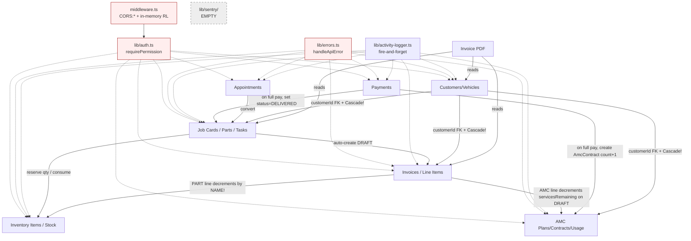

# MAPS.md — gearup Repo, Module, Feature & Interaction Map

## Repo Layout

```
gearup/
├── apps/web/                          # Next.js 14 App Router (single deployable)
│   ├── src/
│   │   ├── app/
│   │   │   ├── admin/                 # Admin SPA pages
│   │   │   ├── api/admin/             # All admin REST endpoints
│   │   │   ├── api/public/            # Public booking/estimate endpoints
│   │   │   └── (public)/              # Customer-facing pages
│   │   ├── lib/
│   │   │   ├── auth.ts                # JWT verify + permission gates
│   │   │   ├── auth/auth-context.tsx  # Client AuthProvider
│   │   │   ├── jwt-secret.ts          # Secret resolution (dev fallback risk)
│   │   │   ├── prisma.ts              # Prisma singleton
│   │   │   ├── errors.ts              # handleApiError + AppError taxonomy
│   │   │   ├── activity-logger.ts     # Fire-and-forget audit logs
│   │   │   ├── id-generators.ts       # jobCard/invoice/appointment numbers
│   │   │   ├── pagination.ts          # paginate() helper (no max-cap)
│   │   │   └── sentry/                # EMPTY .gitkeep — no error reporting
│   │   └── middleware.ts              # CORS:* + in-memory rate limit
│   └── prisma/schema.prisma           # Postgres schema (all models)
└── packages/types/                    # Shared PERMISSIONS, RoleKey, enums
```

## Module Map

| Module | Responsibility | Owns | Routes | Depends on | Depended on by |
|---|---|---|---|---|---|
| **Auth & RBAC** | JWT issue/verify, login, RBAC | `lib/auth.ts`, `lib/jwt-secret.ts`, `middleware.ts`, `api/admin/auth/*`, `api/admin/settings/admins` | login/me/change-password/admins CRUD | Prisma AdminUser, packages/types | **Every** admin route |
| **Customers/Vehicles/AMC** | Customer/vehicle CRUD, AMC plans + contracts + usage | `api/admin/customers`, `api/admin/vehicles`, `api/admin/amc/*` | 11 routes | Auth, Prisma, ActivityLog | Job-cards (vehicle FK), Invoices (customer FK), AMC usage from invoices |
| **Job Cards / Appointments / Workers** | Job-card lifecycle, parts/tasks/assignments, appointments, worker leave | `api/admin/job-cards/*`, `api/admin/appointments/*`, `api/admin/workers/*` | 24 routes | Auth, Inventory (stock), Invoices (auto-create DRAFT), AMC (services) | Invoices, ServiceRequests |
| **Inventory** | Items, categories, suppliers, stock movements, low-stock | `api/admin/inventory/*` | 9 routes | Auth, Prisma | Job-card parts, Invoice PART lines |
| **Invoices/Payments/PDF** | Invoice lifecycle, line items, finalize, payments, PDF render | `api/admin/invoices/*`, `api/admin/payments` | 12 routes | Auth, Inventory, AMC, Job-cards | Reporting, Customer history |
| **Reporting/Activity Log** | (Inferred) Dashboards reading ActivityLog | `api/admin/customers/[id]/history` | — | All mutating routes (write logs) | — |
| **Public booking/estimate** | Customer-facing booking, estimate request | `api/public/*` (out-of-scope this audit) | — | Customers, Vehicles, ServiceRequest | Appointments, Job-cards (conversion) |

## Feature → Module Map

| Feature | Modules Touched | Critical Chain |
|---|---|---|
| Admin login | Auth, Middleware (CORS, rate-limit) | login → JWT → localStorage → AuthProvider |
| Create job card from booking | Customers → ServiceRequest → Job-cards → Invoices (auto-DRAFT) | **No transaction** — 4 sequential writes |
| Add part to job card | Job-cards → Inventory (reserve) → Invoices (line sync) | **Tx + post-tx invoice sync** — partial atomicity |
| Finalize invoice | Invoices | Read-then-write — double-finalize race |
| Record payment (full) | Invoices → AMC (auto-create contract) → Job-card status DELIVERED | `count()+1` contract number race |
| Use AMC service | AMC contracts → JobCard FK | Read-then-decrement — can go negative |
| Counter sale | Invoices (no jobCard, no vehicle) | AMC plan purchase path may fail on null vehicleId |
| Delete job card | Job-cards → Invoices → Payments → JobCardParts (no stock release) | **No transaction, wrong permission, no stock restore** |

## Interaction / Coupling Diagram



## Surprising / Circular Couplings

1. **Invoice ↔ Job-card ↔ Inventory triangle (untransacted):** adding a part writes to all three with a transaction boundary in the middle — failure mid-flight leaves any pair out of sync.
2. **Customer cascade trap:** `Vehicle.customerId` is `onDelete: Cascade` in schema, but DELETE /customers does an app-level count guard. The cascade always wins — guard is theatre.
3. **AMC → Invoice → Payment → AMC loop:** invoice line decrements AMC servicesRemaining on DRAFT; payment-complete creates a NEW AmcContract via `count()+1`. Two writes to AMC from the invoice flow, neither atomic with the invoice state.
4. **`referenceItemId` overloading:** one column points to InventoryItem (PART), AmcPlan (AMC), or AmcContract (AMC usage). DELETE-line code disambiguates by `lineType` — a row with wrong lineType corrupts inventory.
5. **God-node files:** `lib/auth.ts` (every admin route), `middleware.ts` (every API route — CORS:* affects public + admin alike), `lib/errors.ts` (every handler), Prisma schema (all models — no module boundaries).
6. **Sentry directory is empty (`.gitkeep`):** referenced everywhere implicitly via `handleApiError`'s `console.error` fallback — silent error sink wired up.
